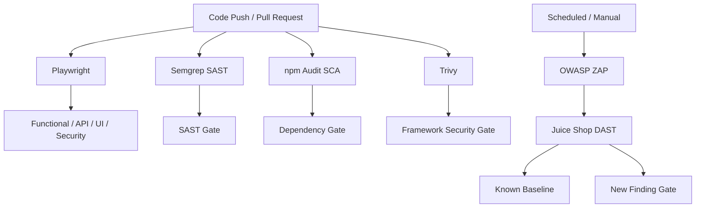

# OWASP Juice Shop Playwright Security Automation

**Playwright + TypeScript Quality Engineering and Application Security automation framework** built against OWASP Juice Shop.

The project combines functional, API, contract, UI and security regression testing with SAST, SCA, repository scanning, container scanning and DAST in GitHub Actions.

## Overview

The framework demonstrates:

- functional browser automation,
- REST API automation,
- API contract validation,
- accessibility testing,
- responsive testing,
- visual regression testing,
- authentication/authorization/session security checks,
- SAST with Semgrep,
- SCA with npm audit,
- Trivy repository/container scanning,
- OWASP ZAP DAST,
- CI/CD quality gates,
- security baselining,
- GitHub Actions evidence.

OWASP Juice Shop is intentionally vulnerable. Known target vulnerabilities are therefore documented and baselined rather than hidden or treated as defects in the automation framework.

## Automated Test Coverage

| Area | Coverage |
| --- | --- |
| Authentication | Registration, valid login, invalid login, logout |
| Products | Search and product selection |
| Basket | Add, increase, decrease and remove |
| Checkout | Address, payment and order flow |
| API | Authentication, products, basket |
| Contract Testing | Zod schema validation |
| Accessibility | Axe automated checks |
| Responsive UI | Mobile and tablet layouts |
| Visual Regression | Product catalogue, login and basket |
| Authorization | Privileged route access controls |
| Session Security | Logout persistence and JWT tampering |
| HTTP Security | Security header regression |
| Input Validation | API and browser input handling |
| API Security | Authentication, methods and CORS |

## Security Automation

| Security Layer | Tool | CI Policy |
| --- | --- | --- |
| Application Security | Playwright | Regression gate |
| SAST | Semgrep | Blocking |
| SCA | npm audit | High/Critical blocking |
| Supply Chain | Dependabot | Automated update PRs |
| Repository Security | Trivy | High/Critical blocking |
| Secret Scanning | Trivy | Blocking when applicable |
| Container Security | Trivy | Juice Shop report-only |
| DAST | OWASP ZAP | Baseline-aware gate |

## Project Structure

```text
config/
framework/
  api/
  components/
  data/
  fixtures/
  helpers/
  pages/
  utils/

tests/
  setup/
  functional/
  api/
  ui/
  security/

security/
  sast/
  sca/
  container/
  dast/
  baselines/
  reports/

docs/

.github/
  workflows/
```

## CI/CD Security Architecture



## Security Baseline Strategy

Known Juice Shop vulnerabilities are recorded in:

- `security/baselines/known-findings.yml`
- `security/dast/zap-baseline.conf`
- `security/dast/zap-full.conf`

Framework regressions remain blocking.

New findings outside the approved baseline require review.

## Current Security Baseline

### Semgrep

```text
0 blocking findings
```

### npm Audit

```text
0 known vulnerabilities
```

### Trivy Framework

```text
0 High/Critical applicable findings
0 unexpected secrets
```

### OWASP ZAP Full Scan

| Severity | Alert Types |
| --- | ---: |
| High | 0 |
| Medium | 5 |
| Low | 5 |
| Informational | 5 |

Known target findings include:

- Backup File Disclosure
- Bypassing 403
- CORS Misconfiguration
- Missing Content Security Policy
- Cross-Domain Misconfiguration
- Missing cross-origin policy headers
- Dangerous JavaScript Functions
- Deprecated Feature Policy
- Unix Timestamp Disclosure

## Running Tests

Install dependencies:

```bash
npm ci
```

Install Playwright browser dependencies:

```bash
npx playwright install
```

Run API tests:

```bash
npx playwright test --project=api
```

Run Chromium tests:

```bash
npx playwright test --project=chromium --workers=1
```

Run security tests:

```bash
npm run test:security
```

Run TypeScript validation:

```bash
npx tsc --noEmit
```

Run dependency security:

```bash
npm run security:sca
```

## Test Isolation

API tests use isolated runtime users and can run in parallel.

Authenticated browser tests currently run sequentially because some flows reuse setup-created authentication/basket state.

## CI Security Evidence

GitHub Actions retains generated evidence such as:

- Playwright HTML reports
- screenshots and traces
- Semgrep SARIF
- npm audit JSON
- Trivy SARIF
- Juice Shop Trivy JSON
- OWASP ZAP HTML
- OWASP ZAP JSON
- OWASP ZAP Markdown
- ZAP execution logs

Generated reports are excluded from source control.

## Documentation

- `docs/test-strategy.md`
- `docs/traceability-matrix.md`
- `docs/security-testing.md`
- `docs/ci-quality-gates.md`
- `docs/architecture.md`
- `docs/findings.md`
- `docs/reporting-strategy.md`

## Current Limitations

- Chromium is the primary CI browser.
- Authenticated browser tests currently use sequential execution.
- Automated accessibility testing is not full WCAG certification.
- ZAP active scanning is primarily CI-based.
- Performance/load testing is out of scope.
- Automated security testing does not replace manual penetration testing.

## Core Principle

> Do not hide known vulnerabilities and do not weaken tests merely to make the pipeline green. Investigate, classify, document, baseline and gate findings according to their actual context.
